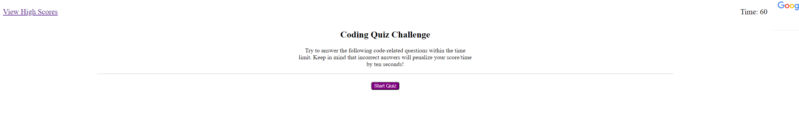

# Coding Quiz
This application is a coding quiz that displays coding-related questions to ask the user, to which the user is able to choose between 4 multiple choice answers. The user has 60 seconds to answer the questions. Everytime they answer incorrectly, their timer, which is also their final score, loses 10 seconds.

Upon visiting the webpage and clicking the Start Quiz button, the user will then be presented with the first question, and the timer will start to countdown from 60 seconds. The user then clicks one of the four multiple choice answer buttons, and is presented with either "Correct!" or "Wrong!" depending on if they got the answer correct or incorrect. They will then be presented with the next question and the process will repeat until either they answer every question or the timer reaches 0. Finally, they will be presented with their final score and have the option to save their score to the high scores page with their initials. This is done through local storage.

## Link to Repository
[GitHub](https://github.com/mcall0147/coding-quiz)

## Link to Website
[Coding Quiz](https://mcall0147.github.io/coding-quiz/)

## Screenshot of Working Application
